NOAA CoastWatch Nodes and participants in the CoastWatch satellite courses.

<div class="project-grid">

```{=html}
<!-- Project Card 1 -->
<div class="project-card open-modal" data-modal="modal-ecocast">
  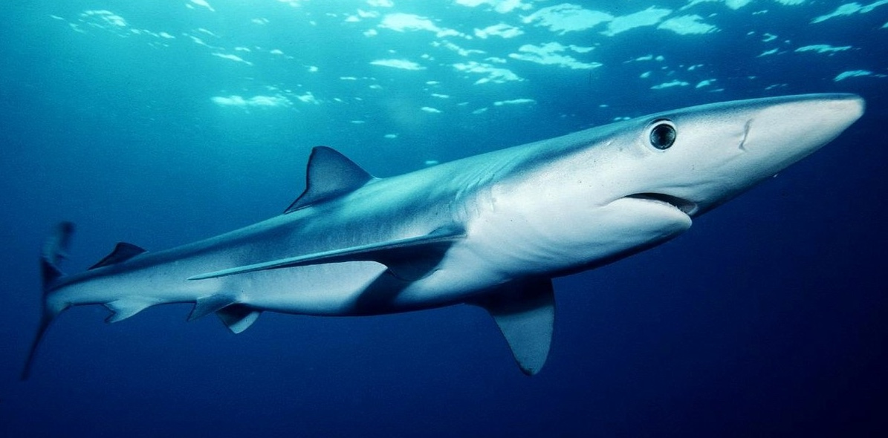
  <h3>Dynamic Ocean Management</h3>
  <h7>EcoCast</h7>
</div>

<!-- Project Card 2 -->
<div class="project-card open-modal" data-modal="modal-turtle">
  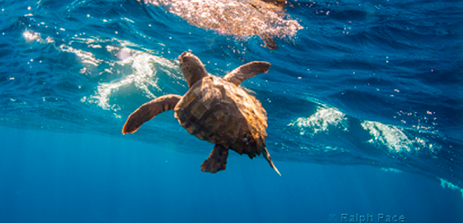
  <h3>Turtle Conservation</h3>
  <h7>Loggerhead Turtles Bycatch</h7>
</div>

<!-- Project Card 3: WhaleWatch -->
<div class="project-card open-modal" data-modal="modal-whalewatch">
  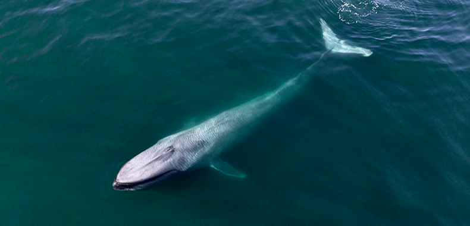
  <h3>Blue Whale Conservation</h3>
  <h7>WhaleWatch 2.0</h7>
</div>

<!-- Project Card 4: Sardine Potential Habitat -->
<div class="project-card open-modal" data-modal="modal-sardine">
  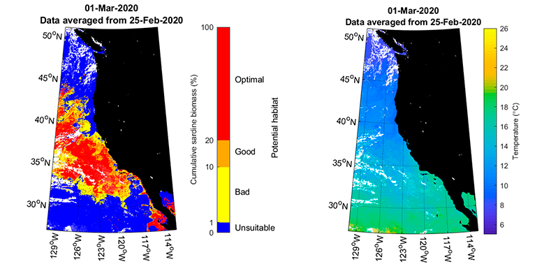
  <h3>Habitat Modeling</h3>
  <h7>Sardine Potential Habitat</h7>
</div>

<!-- Project Card 5: PolarWatch -->
<div class="project-card open-modal" data-modal="modal-polarwatch">
  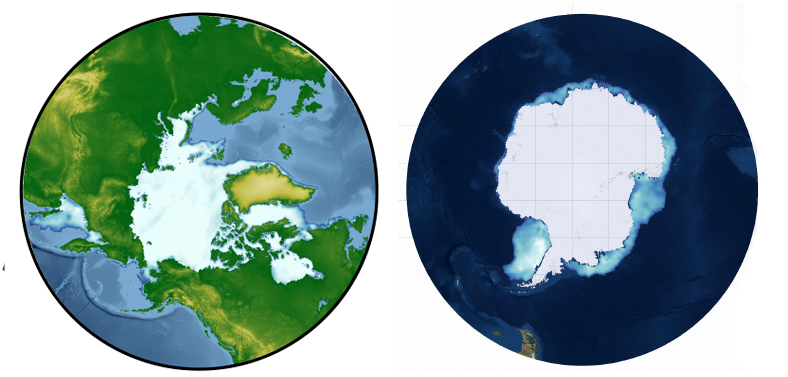
  <h3>Polar Regions Satellite Data</h3>
  <h7>PolarWatch</h7>
</div>

<!-- Project Card 6: Particulate Organic Carbon -->
<div class="project-card open-modal" data-modal="modal-poc">
  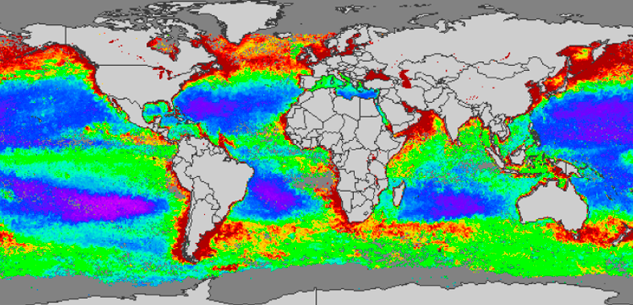
  <h3>POC Algorithm Development</h3>
  <h7>Particulate Organic Carbon</h7>
</div>

<!-- Project Card 7: Advancing WCOFS Modeling -->
<div class="project-card open-modal" data-modal="modal-oceanmodeling">
  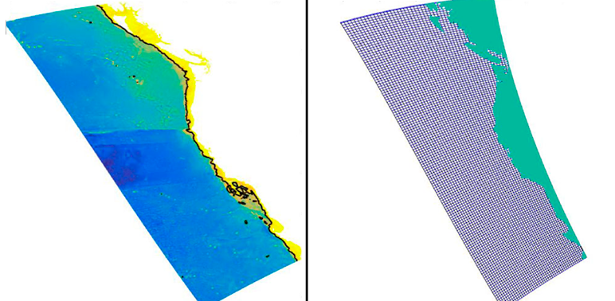
  <h3>Ocean Modeling</h3>
  <h7>Advancing WCOFS Modeling</h7>
</div>

<!-- Project Card 8: C-HARM HABs Forecast -->
<div class="project-card open-modal" data-modal="modal-charm">
  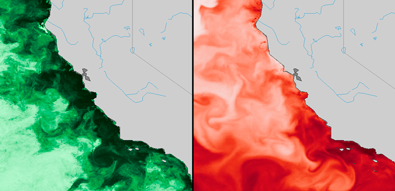
  <h3>Harmful Algal Blooms</h3>
  <h7>C-HARM HABs Forecast</h7>
</div>

<!-- Project Card 9: Fisheries Stock Assessment -->
<div class="project-card open-modal" data-modal="modal-fishstock">
  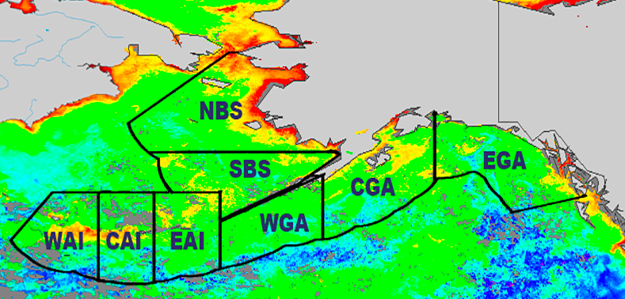
  <h3>Fisheries Stock Assessment</h3>
  <h7>Alaska Stock Assessment Tool</h7>
</div>

<!-- Project Card 10: CoastWatch Satellite Course -->
<div class="project-card open-modal" data-modal="modal-satcourse">
  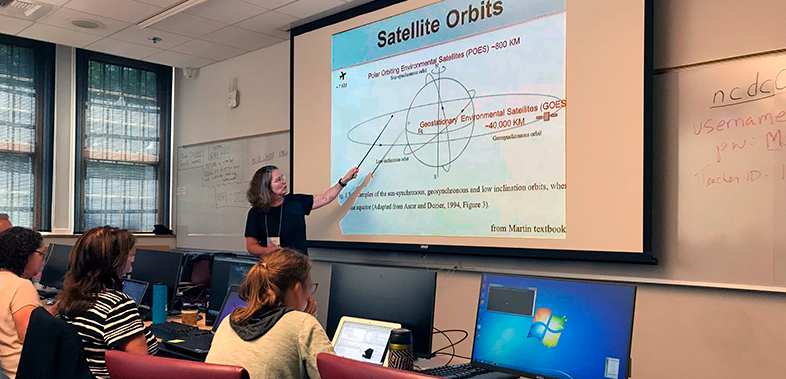
  <h3>User Training Courses</h3>
  <h7>CoastWatch Satellite Course</h7>
</div>

<!-- Project Card 11: Tutorials: Using ERDDAP -->
<div class="project-card open-modal" data-modal="modal-tutorials">
  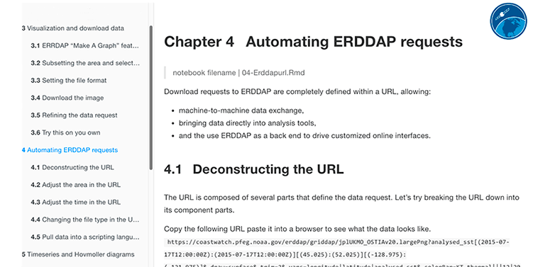
  <h3>Tutorials: Using ERDDAP</h3>
  <h7>Accessing Satellite Data</h7>
</div>

<!-- Project Card 12: Coding Tutorials -->
<div class="project-card open-modal" data-modal="modal-coding">
  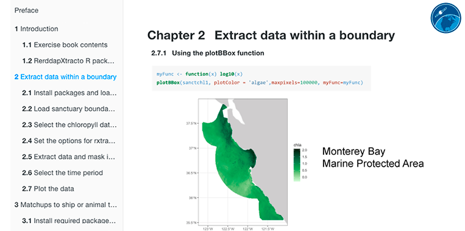
  <h3>Tutorials: R and Python</h3>
  <h7>Accessing Satellite Data</h7>
</div>
```

</div>

<!-- Modals -->
```{=html}
<!-- Modal for EcoCast -->
<div id="modal-ecocast" class="modal">
  <div class="modal-content">
    <span class="close-btn">&times;</span>
    <h2>EcoCast Fisheries Management Tool</h2>

    <div class="modal-columns">
      <!-- LEFT COLUMN -->
      <div class="modal-column">
        <!-- Image stacked above description -->
        
        <p class="caption">The blue shark is a protected species included in the EcoCast fisheries sustainability tool.</p>

        <h4>Partners</h4>
        <p>San Diego State University, UC Santa Cruz, University of Maryland, Old Dominion University, Stanford University, and NOAA SWFSC Environmental Research Division.</p>
      </div>

      <!-- RIGHT COLUMN -->
      <div class="modal-column">
        <h4>Description</h4>
        <p>CoastWatch West Coast Node (WCN) provides satellite data products and a web presence to the EcoCast project. EcoCast is a real-time tool to help fishers and managers allocate fishing effort to optimize the harvest of target fish while minimizing bycatch of protected species. WCN also serves the EcoCast products via ERDDAP.</p>

        <h4>Funding</h4>
        <p>NASA EcoForecasting and Applied Science program (NNH12ZDA001N-ECOF) with additional support from California SeaGrant, NOAA Bycatch Reduction Engineering Program, NOAA West Coast Regional Office, NOAA Integrated Ecosystem Assessment program, Stanford’s Center for Ocean Solutions, and NOAA CoastWatch.</p>

         <a href="https://example.com/ecocast" target="_blank" class="btn btn-primary">Homepage</a>
      </div>
    </div>
  </div>
</div>

<!-- Modal for Turtles -->
<div id="modal-turtle" class="modal">
  <div class="modal-content">
    <span class="close-btn">&times;</span>
    <h2>Loggerhead Turtles Bycatch</h2>

    <div class="modal-columns">
      <!-- LEFT COLUMN -->
      <div class="modal-column">
        <!-- Image stacked above description -->
        
        <p class="caption">A Loggerhead turtle swimming in the waters off Southern California.</p>

        <h4>Partners</h4>
        <p>UC Santa Cruz, NOAA Southwest Fisheries Science Center, Stanford University, ant the University of Maryland.</p>
      </div>

      <!-- RIGHT COLUMN -->
      <div class="modal-column">
        <h4>Description</h4>
        <p>The TOTAL (Temperature Observations To Avoid Loggerheads) project uses satellite-based environmental indicators within a dynamic ocean management framework to deliver a tool that helps minimize loggerhead bycatch without causing undue impact on the industry. The CoastWatch West Coast Node provides satellite data products and a web presence for the project.</p>

        <h4>Funding</h4>
        <p>NOAA Fisheries’ Bycatch Reduction Engineering Program (grant number NA16NMF4720278), with support from NOAA Southwest Fisheries Science Center and NOAA CoastWatch.</p>

         <a href="https://example.com/ecocast" target="_blank" class="btn btn-primary">Homepage</a>
      </div>
    </div>
  </div>
</div>

<!-- Modal for WhaleWatch -->
<div id="modal-whalewatch" class="modal">
  <div class="modal-content">
    <span class="close-btn">&times;</span>
    <h2>WhaleWatch 2.0: Reduce Risk to Blue Whales of Ship Strikes</h2>

    <div class="modal-columns">
      <!-- LEFT COLUMN -->
      <div class="modal-column">
        <!-- Image stacked above description -->
        
        <p class="caption">A blue whale surfacing in the waters off the California coast within the California Current Ecosystem.</p>

        <h4>Partners</h4>
        <p>A consortium of scientists, managers, and members of the shipping industry. The WhaleWatch 2.0 team is scientists from University of California Santa Cruz and Oregon State University and NOAA’s Environmental Resource Division.</p>
      </div>

      <!-- RIGHT COLUMN -->
      <div class="modal-column">
        <h4>Description</h4>
        <p>The WhaleWatch 2.0 project produces a daily map product that is a predictive spatial management tool to categorize suitable blue whale habitat within the California Current Ecosystem. The map identifies where whales are most likely to be each day based on current environmental conditions, such as ocean temperature and productivity.</p>

        <h4>Funding</h4>
        <p>The Benioff Ocean Initiative.</p>

         <a href="https://example.com/ecocast" target="_blank" class="btn btn-primary">Homepage</a>
      </div>
    </div>
  </div>
</div>

<!-- Modal for Sardine Potential Habitat -->
<div id="modal-sardine" class="modal">
  <div class="modal-content">
    <span class="close-btn">&times;</span>
    <h2>Sardine Potential Habitat</h2>

    <div class="modal-columns">
      <!-- LEFT COLUMN -->
      <div class="modal-column">
        <!-- Image stacked above description -->
        
        <p class="caption">Maps of potential sardine habitat (left) and sea surface temperature maps (right).</p>

        <h4>Partners</h4>
        <p>NOAA's Southwest Fisheries Science Center.</p>
      </div>

      <!-- RIGHT COLUMN -->
      <div class="modal-column">
        <h4>Description</h4>
        <p>CoastWatch West Coast Node is operationalizing the Pacific sardines predictive habitat model. The model characterizes the relationships between the occurrence of the northern stock of Pacific sardine and the species' preferred habitat, as determine from environment factors measured with satellites. The predicted habitat can be used to schedule the time and location of ship and aerial surveys to create an optimal sampling strategy.</p>

        <h4>Funding</h4>
        <p>NOAA CoastWatch.</p>

         <a href="https://example.com/ecocast" target="_blank" class="btn btn-primary">Homepage</a>
      </div>
    </div>
  </div>
</div>

<!-- Modal for Polarwatch -->
<div id="modal-polarwatch" class="modal">
  <div class="modal-content">
    <span class="close-btn">&times;</span>
    <h2>PolarWatch</h2>

    <div class="modal-columns">
      <!-- LEFT COLUMN -->
      <div class="modal-column">
        <!-- Image stacked above description -->
        
        <p class="caption">Sea Ice Cover in the Arctic and the Antarctic.</p>

        <h4>Partners</h4>
        <p>The Alaska Fisheries Science Center (AFSC), the National Ice Center, the National Snow and Ice Center, CoastWatch West Coast Node and Central Office, and the NOAA SWFSC Environmental Research and Fisheries Antarctic Ecosystem Research Divisions.</p>
      </div>

      <!-- RIGHT COLUMN -->
      <div class="modal-column">
        <h4>Description</h4>
        <p>PolarWatch extends the CoastWatch program by providing high-latitude satellite observation data to governmental, academic, commercial, and public users in support of broad applications in the Arctic and Southern Oceans.</p>

        <h4>Funding</h4>
        <p>NOAA CoastWatch.</p>

         <a href="https://polarwatch.noaa.gov/" target="_blank" class="btn btn-primary">Homepage</a>
      </div>
    </div>
  </div>
</div>

<!-- Modal for Particulate Organic Carbon -->
<div id="modal-poc" class="modal">
  <div class="modal-content">
    <span class="close-btn">&times;</span>
    <h2>Particulate Organic Carbon</h2>

    <div class="modal-columns">
      <!-- LEFT COLUMN -->
      <div class="modal-column">
        <!-- Image stacked above description -->
        
        <p class="caption">Global POC distribution generated with a potential new algorithm for the SeaWiFS sensor.</p>

        <h4>Partners</h4>
        <p>UC San Diego's Scripps Institution of Oceanography.</p>
      </div>

      <!-- RIGHT COLUMN -->
      <div class="modal-column">
        <h4>Description</h4>
        <p>Particulate organic carbon (POC) is a standard global product that is generated for many ocean color sensors. The POC algorithm used as of 2020 is over a decade old and was validated with only limited in situ observations. CoastWatch West Coast Node is supporting the work of researchers from Scripps Institution of Oceanography to develop updated POC algorithms for the SeaWiFS, MODIS, and VIIRS ocean color satellites.</p>

        <h4>Funding</h4>
        <p>NASA Science of TERRA, AQUA, and SUOMI NPP program (80NSSC18K0956) with support from NOAA CoastWatch.</p>

         <a href="https://example.com/ecocast" target="_blank" class="btn btn-primary">Homepage</a>
      </div>
    </div>
  </div>
</div>

<!-- Modal for Advancing WCOFS Modeling -->
<div id="modal-oceanmodeling" class="modal">
  <div class="modal-content">
    <span class="close-btn">&times;</span>
    <h2>Advancing WCOFS Modeling</h2>

    <div class="modal-columns">
      <!-- LEFT COLUMN -->
      <div class="modal-column">
        <!-- Image stacked above description -->
        
        <p class="caption">WCOFS model output for bathymetry (left) and the model grid (right).</p>

        <h4>Partners</h4>
        <p>UC Santa Cruz, NOAA National Environmental Satellite Data and Information Service, NOAA National Marine Fisheries Service, NOAA Coast Survey Development Lab, Northwest Association of Networked Ocean Observing System, and Central & Northern California Ocean Observing System.</p>
      </div>

      <!-- RIGHT COLUMN -->
      <div class="modal-column">
        <h4>Description</h4>
        <p>CoastWatch West Coast Node is a member of a research group working to transition established ecological products that are generated using ocean model output, such as the California-Harmful Algae Risk Mapping (C-HARM) products, to use output from the WCOFS model.</p>

        <h4>Funding</h4>
        <p>U.S. IOOS Coastal and Ocean Modeling Testbed (COMT) program, with support from NOAA CoastWatch.</p>

         <a href="https://comt.ioos.us/projects/wcofs_advancement" target="_blank" class="btn btn-primary">Homepage</a>
      </div>
    </div>
  </div>
</div>

<!-- Modal for C-HARM HABs Forecast -->
<div id="modal-charm" class="modal">
  <div class="modal-content">
    <span class="close-btn">&times;</span>
    <h2>C-HARM HABs Forecast</h2>

    <div class="modal-columns">
      <!-- LEFT COLUMN -->
      <div class="modal-column">
        <!-- Image stacked above description -->
        
        <p class="caption">The probability of Pseudo-nitzschia (left) and Cellular Domoic Acid (right) occurrence of the California coast.</p>

        <h4>Partners</h4>
        <p>Central & Northern California Ocean Observing System, Southern California Coastal Ocean Observing System, UC Santa Cruz, UC Los Angeles, RSS Inc, and NOAA National Ocean Service.</p>
      </div>

      <!-- RIGHT COLUMN -->
      <div class="modal-column">
        <h4>Description</h4>
        <p>The CoastWatch West Coast Node operationalized the C-HARM harmful algal bloom (HAB) products, which predict the occurrences of Pseudo-nitzschia and the domoic acid toxin using sophisticated circulation models, satellite remote-sensing data, and statistical models.</p>

        <h4>Funding</h4>
        <p>National Aeronautics and Space Administration (NNX13AL28G, NNX14AC42G), US IOOS Coastal Ocean Modeling Testbed (COMT), NOAA ECOHAB, and the Packard Foundation with support from NOAA CoastWatch.</p>

         <a href="https://comt.ioos.us/projects/wcofs_advancement" target="_blank" class="btn btn-primary">Homepage</a>
      </div>
    </div>
  </div>
</div>

<!-- Modal for Fisheries Stock Assessment -->
<div id="modal-fishstock" class="modal">
  <div class="modal-content">
    <span class="close-btn">&times;</span>
    <h2>Alaska Stock Assessment Tool</h2>

    <div class="modal-columns">
      <!-- LEFT COLUMN -->
      <div class="modal-column">
        <!-- Image stacked above description -->
        
        <p class="caption">Fisheries management regions in the Bering Sea and the Gulf of Alaska.</p>

        <h4>Partners</h4>
        <p>NOAA Alaska Fisheries Science Center and CoastWatch West Coast Node.</p>
      </div>

      <!-- RIGHT COLUMN -->
      <div class="modal-column">
        <h4>Description</h4>
        <p>CoastWatch West Coast Node has created satellite indices for the Alaskan Fishery Management areas to be used in the Ecosystem and Socioeconomic Profiles (ESP), which are submitted as part of the annual Stock Assessment and Fishery Evaluation (SAFE) Reports.</p>

        <h4>Funding</h4>
        <p>NOAA Alaska Fisheries Science Center and CoastWatch West Coast Node.</p>

         <a href="https://comt.ioos.us/projects/wcofs_advancement" target="_blank" class="btn btn-primary">Homepage</a>
      </div>
    </div>
  </div>
</div>

<!-- Modal for Satellite Courses -->
<div id="modal-satcourse" class="modal">
  <div class="modal-content">
    <span class="close-btn">&times;</span>
    <h2>CoastWatch Satellite Course</h2>

    <div class="modal-columns">
      <!-- LEFT COLUMN -->
      <div class="modal-column">
        <!-- Image stacked above description -->
        
        <p class="caption">Course instructor Dr. Cara Wilson teaching course participants the basics of satellite remote sensing.</p>

        <h4>Partners</h4>
        <p>NOAA CoastWatch Regional Nodes and NOAA CoastWatch Central Office.</p>
      </div>

      <!-- RIGHT COLUMN -->
      <div class="modal-column">
        <h4>Description</h4>
        <p>The CoastWatch West Coast Node offers courses for NOAA scientists and managers, and anybody wanting to learn how to access and use ocean satellite data. The course has been offered each year since 2006.</p>

        <h4>Funding</h4>
        <p>NOAA CoastWatch.</p>

         <a href="https://comt.ioos.us/projects/wcofs_advancement" target="_blank" class="btn btn-primary">Homepage</a>
      </div>
    </div>
  </div>
</div>

<!-- Modal for Tutorials: Using ERDDAP -->
<div id="modal-tutorials" class="modal">
  <div class="modal-content">
    <span class="close-btn">&times;</span>
    <h2>ERDDAP: Accessing Satellite Data</h2>

    <div class="modal-columns">
      <!-- LEFT COLUMN -->
      <div class="modal-column">
        <!-- Image stacked above description -->
        
        <p class="caption">Online lesson demonstrating how to construct a URL for an ERDDAP data request.</p>

        <h4>Partners</h4>
        <p>NOAA CoastWatch Nodes and participants in the CoastWatch satellite courses.</p>
      </div>

      <!-- RIGHT COLUMN -->
      <div class="modal-column">
        <h4>Description</h4>
        <p>CoastWatch West Coast Node provides online tutorials on how to visualize and access satellite data using the ERDDAP data server.</p>

        <h4>Funding</h4>
        <p>NOAA CoastWatch.</p>

         <a href="https://comt.ioos.us/projects/wcofs_advancement" target="_blank" class="btn btn-primary">Homepage</a>
      </div>
    </div>
  </div>
</div>

<!-- Modal for Coding Tutorials -->
<div id="modal-coding" class="modal">
  <div class="modal-content">
    <span class="close-btn">&times;</span>
    <h2>R and Python: Accessing Satellite Data</h2>

    <div class="modal-columns">
      <!-- LEFT COLUMN -->
      <div class="modal-column">
        <!-- Image stacked above description -->
        
        <p class="caption">An online tutorial with example R code that downloads satellite data for an irregularly shaped area using the RerddapXactractomatic package.</p>

        <h4>Partners</h4>
        <p>NOAA CoastWatch Nodes and participants in the CoastWatch satellite courses.</p>
      </div>

      <!-- RIGHT COLUMN -->
      <div class="modal-column">
        <h4>Description</h4>
        <p>CoastWatch West Coast Node provides online tutorials on how to download and use satellite data using the R software package and RerddapXtractomatic library.</p>

        <h4>Funding</h4>
        <p>NOAA CoastWatch.</p>

         <a href="https://comt.ioos.us/projects/wcofs_advancement" target="_blank" class="btn btn-primary">Homepage</a>
      </div>
    </div>
  </div>
</div>
```

<!-- Modal JavaScript -->
```{=html}
<script>
document.addEventListener("DOMContentLoaded", function () {
  // Open modal when any .project-card with .open-modal is clicked
  document.querySelectorAll(".project-card.open-modal").forEach(card => {
    card.addEventListener("click", () => {
      const modalId = card.getAttribute("data-modal");
      const modal = document.getElementById(modalId);
      if (modal) modal.classList.add("show");
    });
  });

  // Close modal when "×" button is clicked
  document.querySelectorAll(".close-btn").forEach(button => {
    button.addEventListener("click", () => {
      const modal = button.closest(".modal");
      if (modal) modal.classList.remove("show");
    });
  });

  // Close modal when clicking outside the modal content
  window.addEventListener("click", (e) => {
    document.querySelectorAll(".modal").forEach(modal => {
      if (e.target === modal) {
        modal.classList.remove("show");
      }
    });
  });

  // Close modal when pressing Escape key
  document.addEventListener("keydown", function (e) {
    if (e.key === "Escape") {
      document.querySelectorAll(".modal.show").forEach(modal => modal.classList.remove("show"));
    }
  });
});
</script>
```