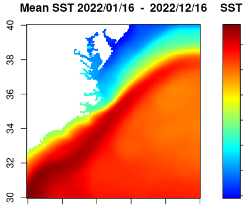
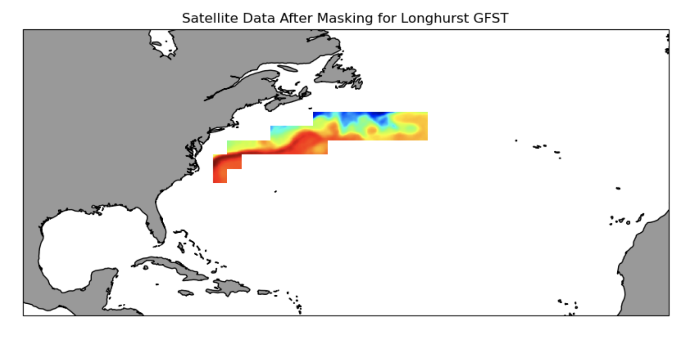
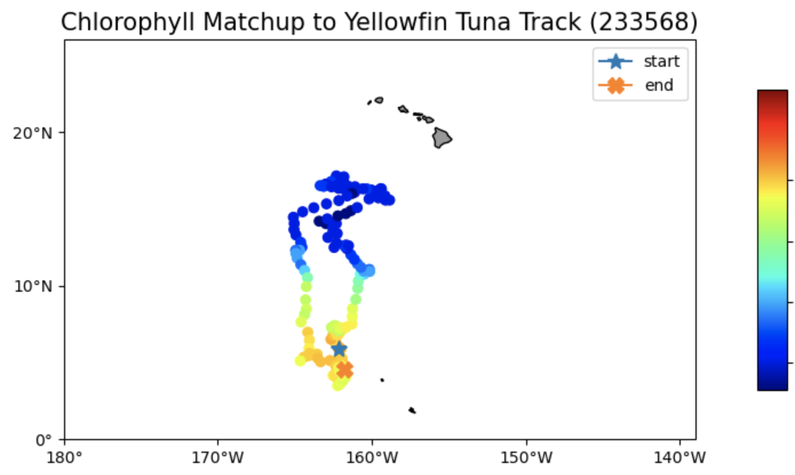
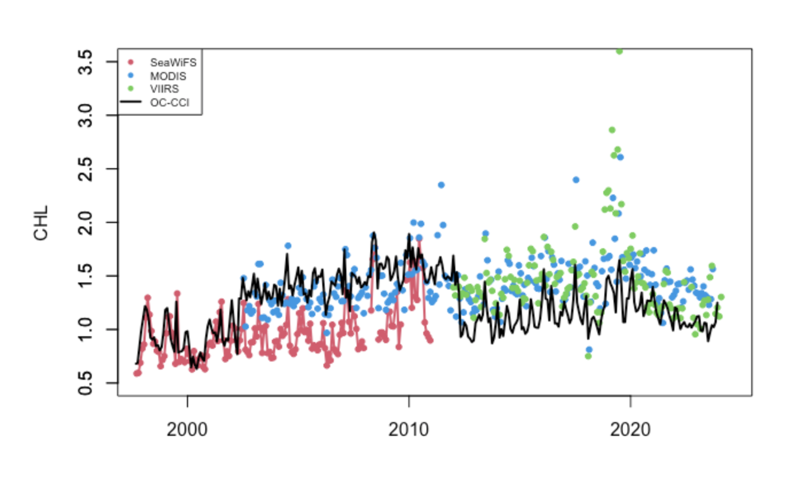
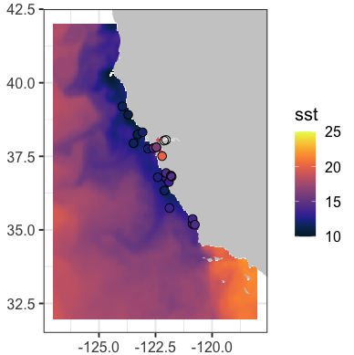
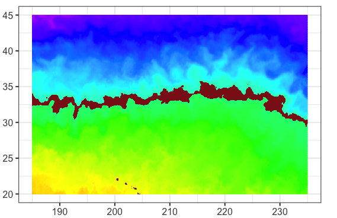
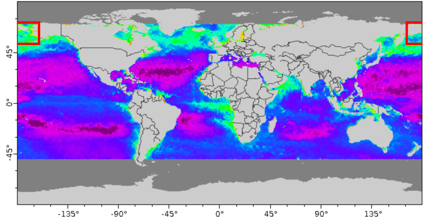
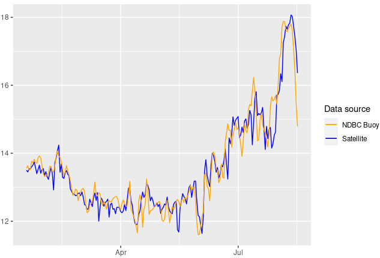

Examples demonstrating accessing and working with ocean satellite data from ERDDAP servers.

To view all tutorials, visit our [Github](https://github.com/coastwatch-training/CoastWatch-Tutorials/tree/main).

::: {.tutorial-grid}

::: {.tutorial-card}

PYTHON, R, MATLAB

<h3>Basics of Working with Satellite Data</h3>

Learn how to access ERDDAP data, handle NetCDF files, and create SST maps and time series.

<a href="https://github.com/coastwatch-training/CoastWatch-Tutorials/tree/main/Tutorial1-basics" target="_blank">View in Github</a>

:::

::: {.tutorial-card}

PYTHON, R, MATLAB

<h3>Extract Data Within a Boundary</h3>

Learn how to download SST time series data from an ERDDAP server, mask the data to retain only the data within an irregular geographical boundary (polygon), and plot the yearly seasonal cycle within the boundary.

<a href="https://github.com/coastwatch-training/CoastWatch-Tutorials/tree/main/extract-satellite-data-within-boundary" target="_blank">View in Github</a>

:::

::: {.tutorial-card}

PYTHON, R

<h3>Matchup Satellite Data to Telemetry Data</h3>

Learn how to extract satellite data around a set of points defined by longitude, latitude, and time coordinates, like that produced by an animal telemetry tag, and ship track, or a glider tract.

<a href="https://github.com/coastwatch-training/CoastWatch-Tutorials/tree/main/matchup-satellite-data-to-ATN-animal-tracks" target="_blank">View in Github</a>

:::

::: {.tutorial-card}

PYTHON, R, MATLAB

<h3>Compare Time Series from Different Sensors</h3>

Learn how to extract a time-series of monthly satellite chlorophyll data for the period of 1997-present from four different monthly satellite datasets.

<a href="https://github.com/coastwatch-training/CoastWatch-Tutorials/tree/main/Tutorial2-timeseries-compare-sensors" target="_blank">View in Github</a>

:::

::: {.tutorial-card}

R

<h3>Match Up Satellite and Buoy Data </h3>

Learn how to match up satellite data to in situ buoy data using rerddap and rxtracto R packages.

<a href="https://github.com/coastwatch-training/CoastWatch-Tutorials/tree/main/matchup-satellite-buoy-data" target="_blank">View in Github</a>

:::

::: {.tutorial-card}

PYTHON, R

<h3>Define a Marine Habitat</h3>

Learn how to map satellite sea surface temperature and overlay the 17.5ºC and 18.5ºC contours associated with loggerhead turtle bycatch product, TurtleWatch.

<a href="https://github.com/coastwatch-training/CoastWatch-Tutorials/tree/main/define-marine-habitat" target="_blank">View in Github</a>

:::

::: {.tutorial-card}

PYTHON

<h3>Convert -180+180 to 0-360 Longitude</h3>

Learn how to use datasets with -180 to +180 longitude values to work within regions that cross the antimeridian.

<a href="https://github.com/coastwatch-training/CoastWatch-Tutorials/tree/main/convert-180%2B180-to-0-360-longitude" target="_blank">View in Github</a>

:::

::: {.tutorial-card}

PYTHON, R

<h3>Create a Virtual Buoy with Satellite Data</h3>

Learn how to create a time series from satellite data to gap-fill or replace buoy data.

<a href="https://github.com/coastwatch-training/CoastWatch-Tutorials/tree/main/create-virtual-buoy-with-satellite-data" target="_blank">View in Github</a>

:::
:::

